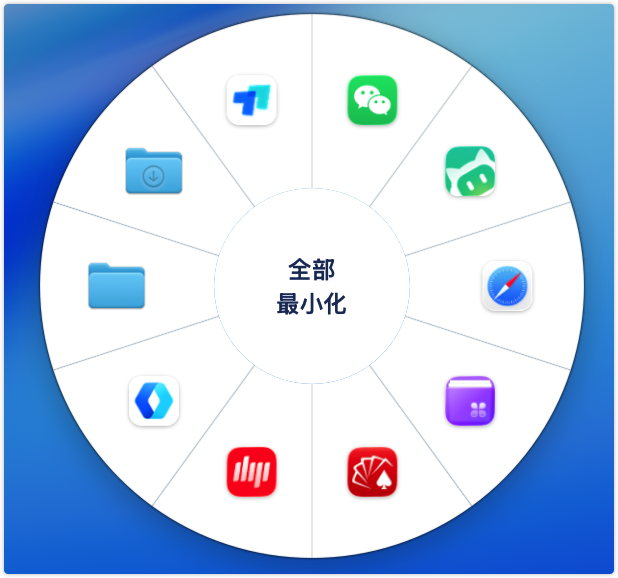
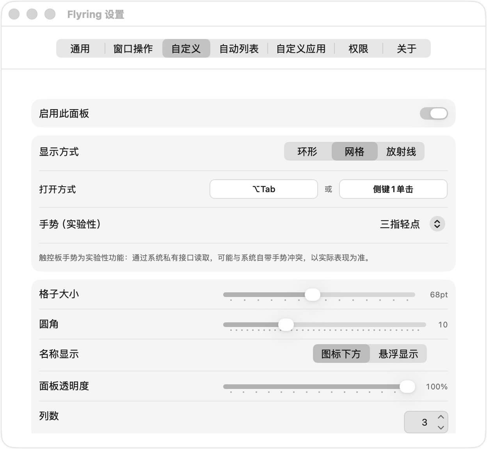
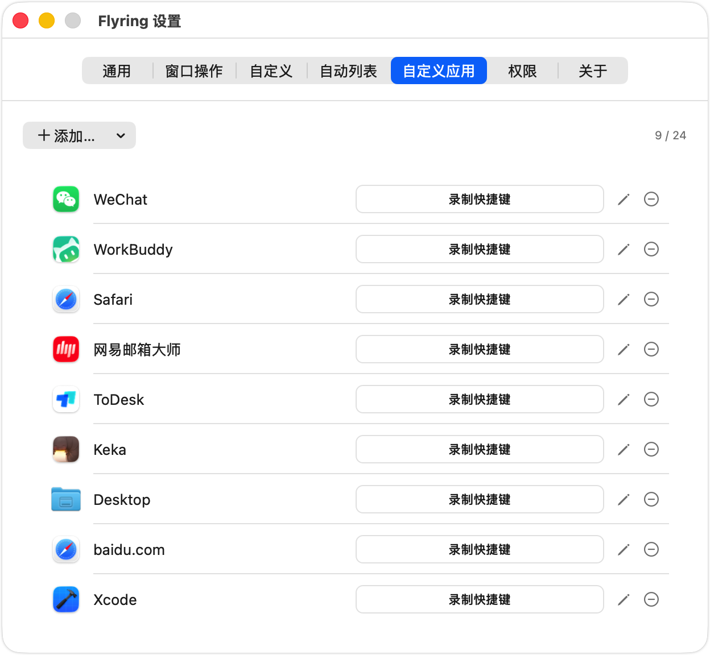

# Flyring

macOS 菜单栏启动器 / 切换器。光标旁边弹出面板，用环形、网格或放射线手势快速启动 App、打开文件、切换窗口。

## 为什么做这个项目

起因特别小：在 Mac 上切换软件，要么按 Spotlight 打字搜索，要么去 Dock 上瞄准点击。一天几十上百次，每次都是几秒钟的小别扭。我想要的东西很具体——光标旁边直接弹出一个面板，放最常用的软件和正在运行的软件，点一下就启动，点完就消失，手不用离开当前的工作区域。

轮盘这个形态其实有先例，市面上的轮盘切换工具并不少——有人做过、有人用，说明方向本身成立。但挨个试下来，每一款都不长在我想要的位置上：要么形态调不成我要的样子，要么唤起方式卡死了改不了，要么可定制程度到那儿就止步了。一些老牌启动器虽然强大，但骨子里是搜索框的思路，「面板贴着光标弹出」这件事不在它们的设计里。

几天的试用帮我确认了三件事：需求是真实的（我自己天天想用）；需求是小众的（这么多现成工具，没有一个顺着做）；差异点是明确的（轻量、贴光标、圆盘形态）。

于是决定自己开发这个版本，把它从一个自用的产品变成一个公开的产品。我想通过完全自己试验这个过程来提高自己——有了这样的想法，才有了这个项目。

## 特性

- 三种呼出面：环形（Ring）/ 网格（Grid）/ 放射线（Fingers）
- 触控板多指手势、鼠标侧键 / 中键、全局快捷键多种唤起方式
- 悬停运行中 App 直接切换其窗口（需屏幕录制权限）
- 自托管激活码，年费 / 买断双模式

## 界面预览

| 环形 | 网格 | 放射线 |
|:---:|:---:|:---:|
|  |  |  |

| 自定义面板 | 自定义 App |
|:---:|:---:|
|  |  |

## 项目状态

当前处于 **Beta 测试**阶段：

- **暂不提供购买服务**，未来价格见下文；
- 现阶段仅提供全功能 **14 天试用版**，下载即可体验，无需付费。

## 下载

最新版见 [Releases](https://github.com/saodisir/flyring/releases)。

> 分发版使用 Developer ID 签名并通过 Apple 公证，首次打开由 Gatekeeper 直接放行。

## 价格（正式版计划）

> 注意：以下为正式开放购买后的计划价格。当前 Beta 测试阶段仅提供 14 天试用版，不开放购买。

- 年费 **¥19.9 / 年**（不自动续费，到期手动续）
- 永久买断 **¥59.9**（激活 3 台机器）

## 购买与激活（暂未开放）

Beta 期间不提供购买服务，以下流程将在正式开放后启用：

1. 通过购买页完成微信 / 支付宝付款
2. 付款后系统发放激活码
3. 打开 Flyring → 设置 → 关于 → 粘贴激活码 → 激活

## 系统要求

macOS 14 及以上。

## 许可

闭源商业软件。本仓库仅托管分发文件（DMG / appcast），不含任何源代码。
